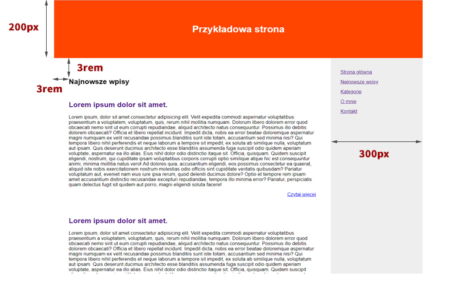
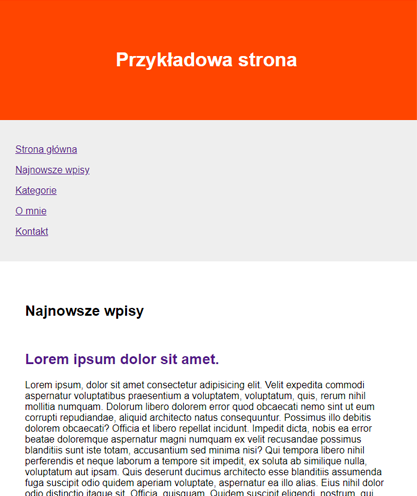
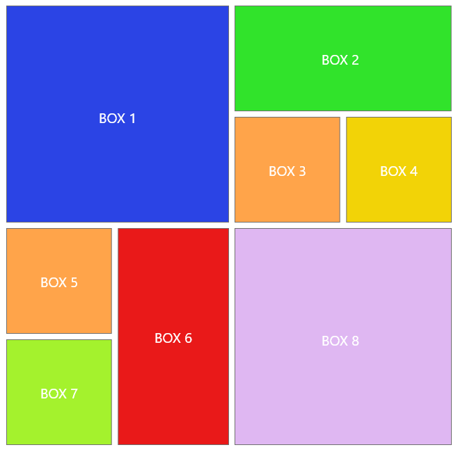

Zadania CSS grid
================

Zadanie 1
---------
W pliku **index.html** za pomocą CSS grid zakodujmy poniższą wizytówkę:

Zadanie rozwiążmy w pliku **_exercise1.scss**, który dołączymy do main.scss.

Zadanie 2
---------
W pliku blog.html jest przykładowy html ze stroną bloga.

**Nie ruszając HTML** stwórzmy layout, który pokazany jest na poniższych screenach.  
Całość stylujmy w pliku **_blog.scss**, który powinien być dołączony do pliku main.scss.

Na urządzeniach z większymi ekranami ( > 768px ) layout powinien wyglądać jak poniżej:

Natomiast na ekranach do 768px struktura powinna się zmienić na poniższą:

Zadanie 3
---------
W pliku **layout.html** znajduje się przykładowy html. 

Nie ruszając kodu HTML ostylujmy go, by wyglądał tak jak na poniższym screenie.

Załóżmy, że każda kostka ma wielkość 200x200px, natomiast odstęp miedzy nimi to 10px.

Stylowanie stwórzmy w pliku **_exercise3.scss**, który dołączymy do main.scss.